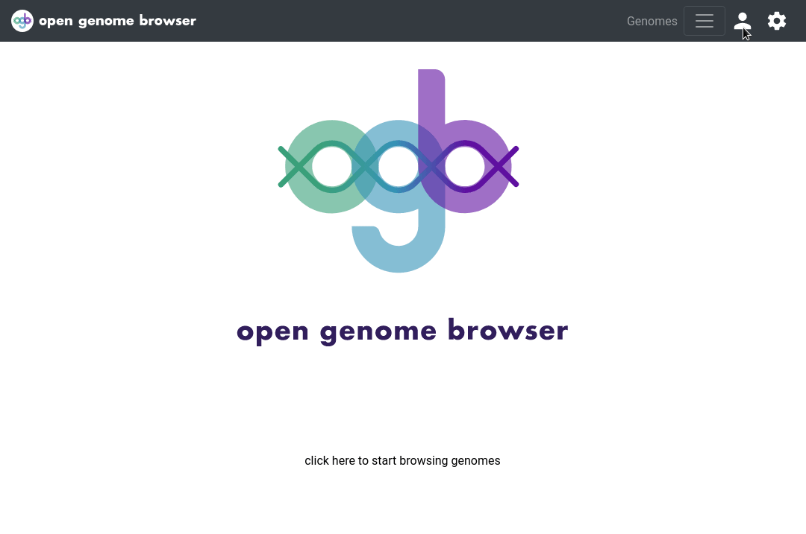

<link rel="shortcut icon" type="image/svg+xml" href="/opengenomebrowser/favicon.svg">

# Admin panel

The admin panel enables specific users to change the metadata in the database:
  - create new tags and edit their descriptions
  - change metadata associated with organisms (e.g.: change TaxId)*
  - change metadata associated with genomes*

*: any changes are immediately implemented to the corresponding`genome.json` or `organism.json` and a backup is made.

This feature allows users of OpenGenomeBrowser without UNIX skills to modify or expand metadata without having to bother the system administrator.

In addition, superusers may create new user accounts.

