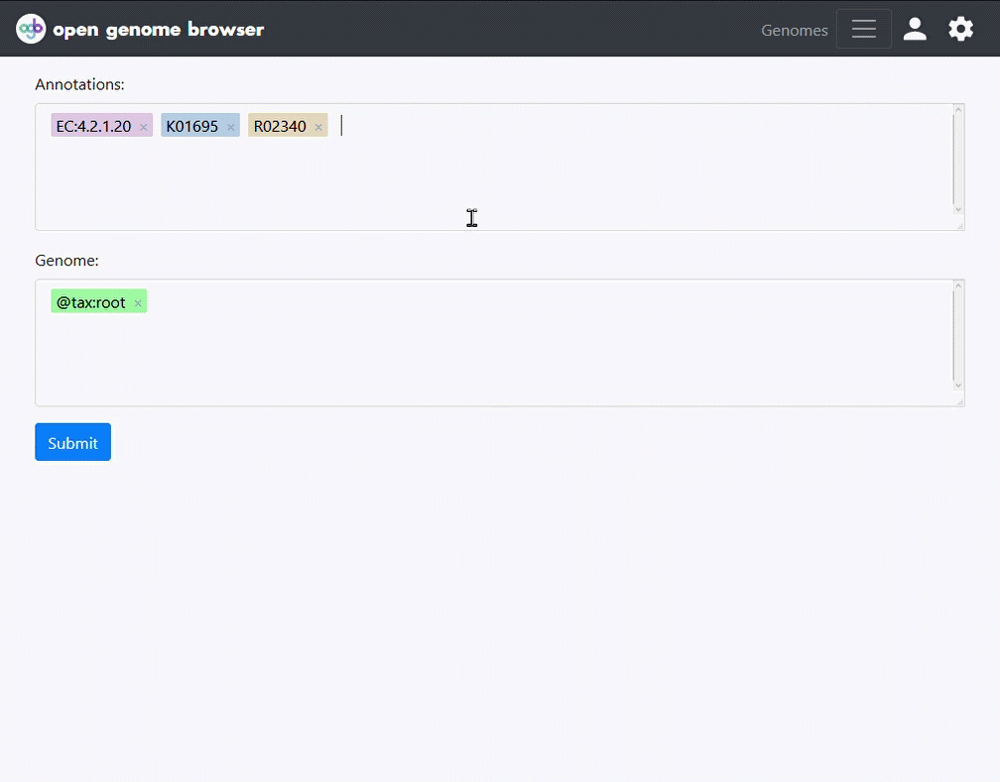

<link rel="shortcut icon" type="image/svg+xml" href="/opengenomebrowser/favicon.svg">

# Annotation search

To find the genomes that cover certain annotations, open the 
[`Annotation search`](https://opengenomebrowser.bioinformatics.unibe.ch/annotation-search/) page from the 'Tools' drop-down menu on the genomes table page.

Enter the annotations to be queried into the top box and the genomes to search through into the lower one, then `submit`.
(Note: consider using [_magic strings_](/tutorials/magic-strings.md)!)

This will load a _coverage matrix_. Each row is a genome and each column is an annotation.

The numbers in the cells tell you how many genes of the genome cover the annotation. A click on a number will show you these genes.

A click on an annotation will open a context menu with more options, for example a link to the [`compare genes`](/tutorials/compare-genes.md) page.

