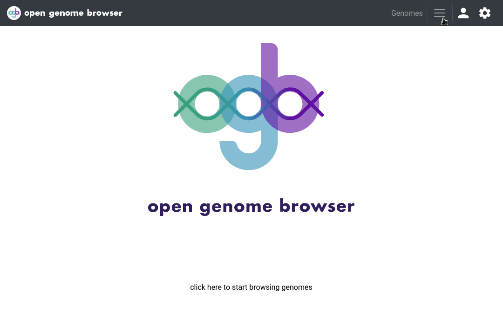

<link rel="shortcut icon" type="image/svg+xml" href="/opengenomebrowser/favicon.svg">

# Blast Search

This page enables BLAST searches ([Camacho et al., BMC Bioinformatics, 2009](https://bmcbioinformatics.biomedcentral.com/articles/10.1186/1471-2105-10-421)) of nucleotide or protein sequences.

First, search and select the genome(s) that you would like to use as reference in the 'Genomes' box and click 'submit'. Then enter the query sequence(s) in fasta format and select the appropriate blast type in the drop-down menu.

