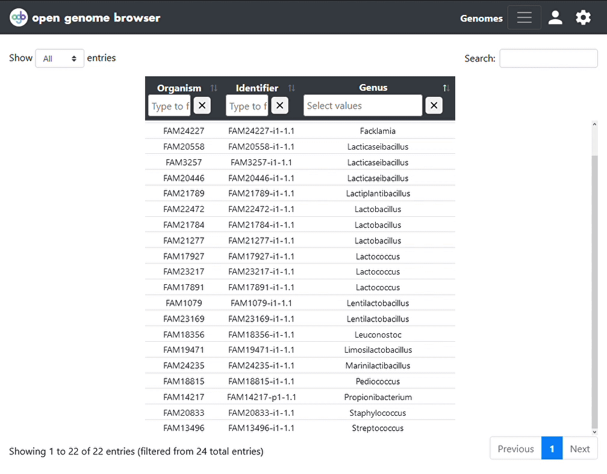

<link rel="shortcut icon" type="image/svg+xml" href="/opengenomebrowser/favicon.svg">

# Gene trait matching

Gene-trait matching can serve as a simple but effective approach to elucidate genes 
responsible for a specific phenotype.

The principle is simple: If one group of genomes has a specific trait and another does not, 
search for orthologous genes (or functional annotations) that occur in one group but not the other.

In the [gene-trait-matching view](https://opengenomebrowser.bioinformatics.unibe.ch/gene-trait-matching/),
define the two groups of genomes. Click on 'Submit'. Click [here](https://opengenomebrowser.bioinformatics.unibe.ch/gene-trait-matching/?alpha=0.1&anno_type=OL&multiple_testing_method=fdr_bh&g1=FAM22472-i1-1.1+FAM19471-i1-1.1+FAM1079-i1-1.1+FAM21784-i1-1.1+FAM20558-i1-1.1+FAM21277-i1-1.1+FAM21789-i1-1.1+FAM23169-i1-1.1+FAM18815-i1-1.1+FAM3257-i1-1.1+FAM20446-i1-1.1&g2=FAM24227-i1-1.1+FAM24235-i1-1.1+FAM18356-i1-1.1+FAM14217-p1-1.1+FAM19036-p1-1.1+FAM19038-p1-1.1+FAM20833-i1-1.1+FAM17927-i1-1.1+FAM23217-i1-1.1+FAM17891-i1-1.1+FAM13496-i1-1.1) 
for an example.

OpenGenomeBrowser will run a [Fisher's exact test](https://en.wikipedia.org/wiki/Fisher%27s_exact_test)
for each orthologous gene and apply Benjamini/Hochberg multiple testing correction (alpha = 10 %).

In the settings sidebar, it is possible to change...
  - ... the category of annotations to use
  - ... the multiple testing algorithm
  - ... the associated alpha value

In addition, the resulting table may be downloaded in CSV format.

