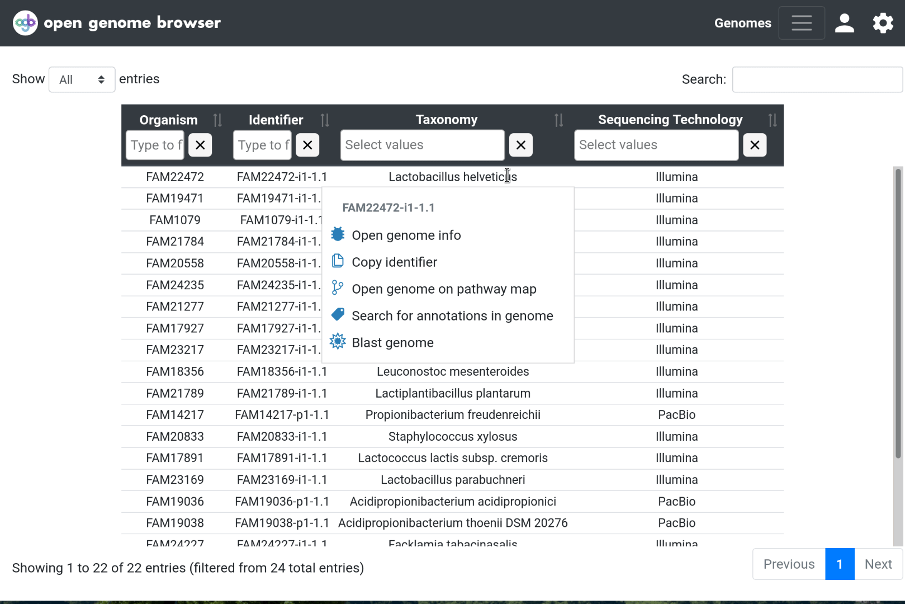

<link rel="shortcut icon" type="image/svg+xml" href="/opengenomebrowser/favicon.svg">

# Single genome view

In the [genomes table](https://opengenomebrowser.bioinformatics.unibe.ch/genomes), right click on a row and
select [`Open genome info`](https://opengenomebrowser.bioinformatics.unibe.ch/genome/FAM18356-i1-1.1/).

  - This page contains all metadata that was fed into OpenGenomeBrowser for this particular genome.
  - Files associated to this genome such as the assembly, coding sequences or annotation files can be downloaded using the links located at the bottom of the page.

