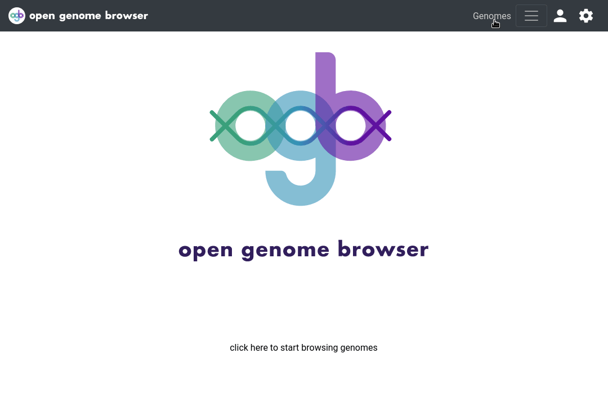

<link rel="shortcut icon" type="image/svg+xml" href="/opengenomebrowser/favicon.svg">

# Genomes table

First, let's explore the genomes table. Click on [`Genomes`](https://opengenomebrowser.bioinformatics.unibe.ch/genomes).

This page contains powerful filter and search options.
  - Columns can be sorted and filtered by clicking on the column header.

To dive deeper into a genome, open the context menu: **right click** on a row.
  - This is an exception: everywhere else on OpenGenomeBrowser the context menu can be opened with a **left click**.

It is possible to select **multiple** genomes by holding down `Shift` and/or `Ctrl` while clicking on rows.
  - The context menu (right click!) includes more options if multiple genomes are selected.

The settings sidebar can be opened by clicking on the wheel in the top right corner of the page. It provides the following options:
  - The current view of the table can be downloaded in CSV or Excel format.
  - By default, only `representative` genomes are visible in the genomes table. To show all genomes choose "all" in the drop-down menu of "show represetatives?" (default is "only").
  - Genomes that are marked `restricted` or `contaminated` are hidden by default. Adjust the settings of "show restricted" and "show contaminated" to change this.
  - Additional metadata columns may be added to the table by moving a field from "available columns" to "visible columns". To submit the changes, click on "Update table".

