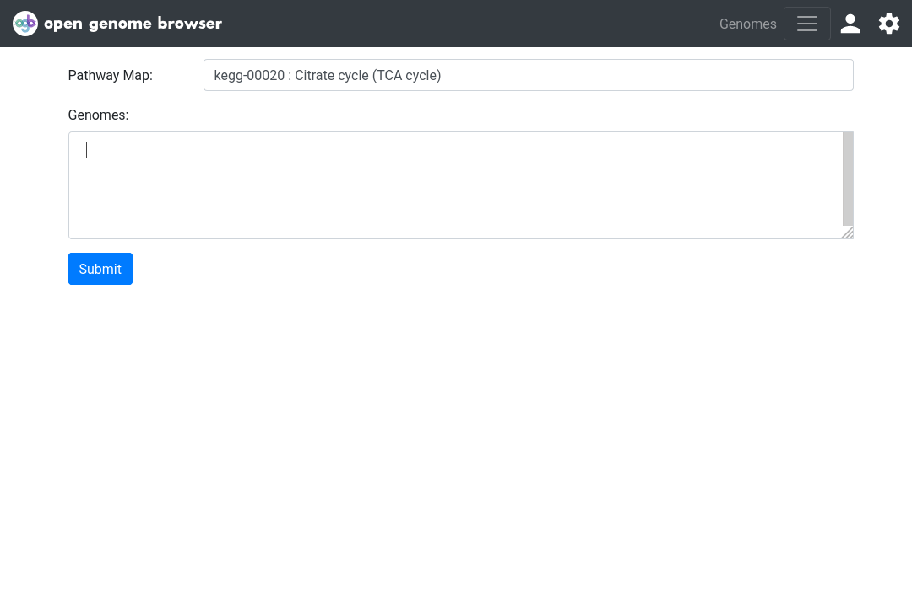

<link rel="shortcut icon" type="image/svg+xml" href="/opengenomebrowser/favicon.svg">

# Select genomes using "magic strings"

Whenever you are faced with an input box for genomes, you can use _magic strings_ to quickly select groups of genomes.

All _magic strings_ start with an asterisk.

For example, to select all* genomes that belong to the genus `Lactobacillus`, enter `@taxgenus:Lactobacillus`.

Alternatively, if the taxonomic class is unknown, `@tax:Lactobacillus` can be used to give the same result. 
Note: problems may arise if multiple taxonomic classes have the same name.

To select all* genomes in the database, enter `@tax:root`, as all NCBI taxids belong to this `root` taxid.

### Important:

_Magic strings_ only return...

  - ... one genome per organism (the _representative_ genome)
  - ... non-contaminated genomes
  - ... non-restricted genomes

Click on `Show query` to see which genomes were selected.

