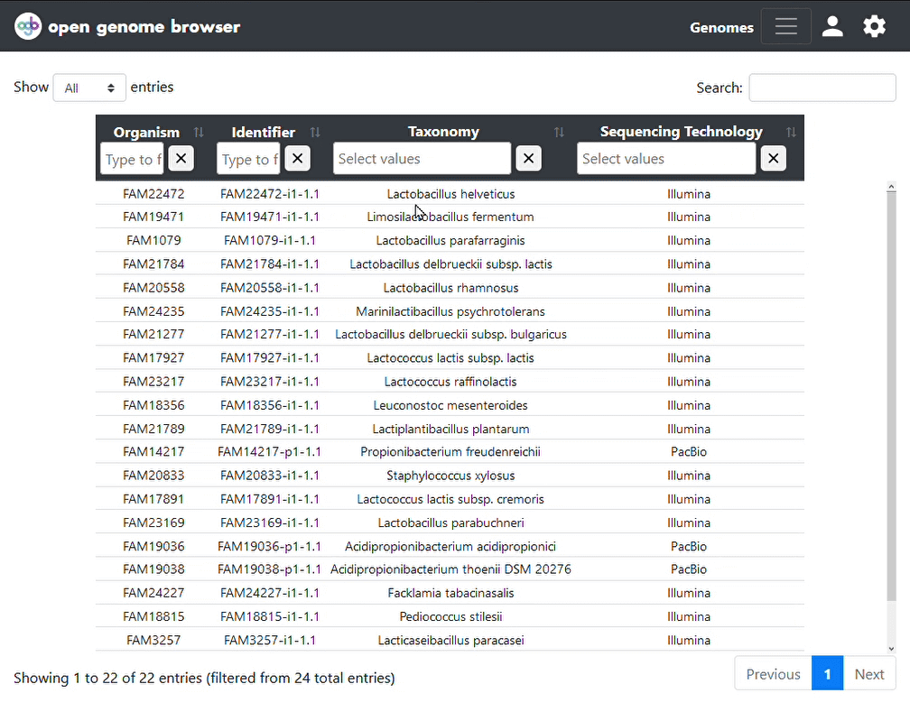

<link rel="shortcut icon" type="image/svg+xml" href="/opengenomebrowser/favicon.svg">

# Pathway Analysis

The [pathways page](https://opengenomebrowser.bioinformatics.unibe.ch/pathway/) allows coloring biochemical 
pathways maps according to covered annotations. There are three modes:

  - single genome mode
  - multiple genomes mode
  - groups of genomes mode

## Usage

The [pathways page](https://opengenomebrowser.bioinformatics.unibe.ch/pathway/) can be accessed by a right click 
on the selection of multiple genomes the genomes table or from the drop-down menu 'Tools' on the top right of 
the genomes table page.

Select a pathway map by entering a search query, for example `citrate cycle`, and selecting a map of interest. On 
the demo server, all KEGG-maps are available. Next, select one or more genomes and click on 'submit'.

It is also possible to [select multiple groups](https://opengenomebrowser.bioinformatics.unibe.ch/pathway/?map=kornec00030&g1=@tax:Lactobacillales&g2=@tax:Propionibacteriales) of genomes, and to see how they differ.

Click on a shape to learn which genomes cover the contained annotations.

Click on a covered annotation, then on ` Compare the genes of this annotation` to see [sequence alignments or 
compare the gene loci](../tutorials/compare-genes.md).

The resulting colored pathway map can be downloaded by clicking on the settings wheel, and then on `Save as PNG`
or `Save as SVG`.

## Meaning of the colors

  - single genome mode
    - transparent: genome does not cover shape
    - red: genome covers shape
  - multiple genomes mode: if a shape is not 
    - transparent: none of the genomes cover shape
    - fully yellow: only one of the genomes covers shape
    - fully red: all genomes cover shape
    - in-between: some genomes cover shape (click on shape to see which!)
  - groups of genomes mode
    - the shape is divided into as many areas as there are groups
      - leftmost are corresponds to first group, etc
    - the colors mean the same thing as in multiple genomes mode
