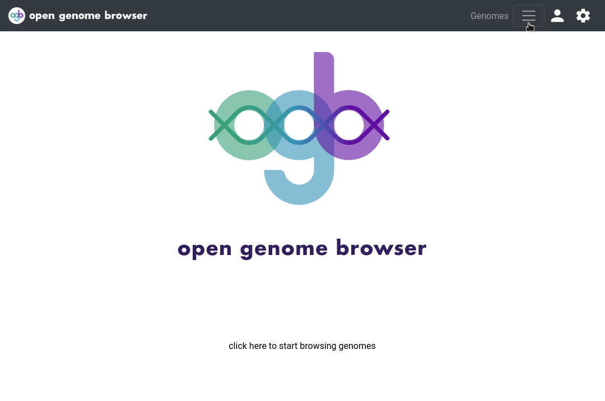

<link rel="shortcut icon" type="image/svg+xml" href="/opengenomebrowser/favicon.svg">

# Pathway Analysis

The [pathways page](https://opengenomebrowser.bioinformatics.unibe.ch/pathway/) can be accessed by a right click on the selection of multiple genomes the genomes table or from the drop-down menu 'Tools' on the top right of the genomes table page.

Select a pathway map by entering a search query, for example `citrate cycle`, and selecting a map of interest. On the demo server, all available KEGG-ko-maps are avilable. Next, select one or more genomes and click on 'submit'.

Click on a shape to learn which genomes cover the contained annotations.

Click on a covered annotation, then on ` Compare the genes of this annotation` to see sequence alignments or compare the gene loci.

The resulting colored pathway map can be downloaded by clicking on the settings wheel, and then on `Save as PNG` or `Save as SVG`.

