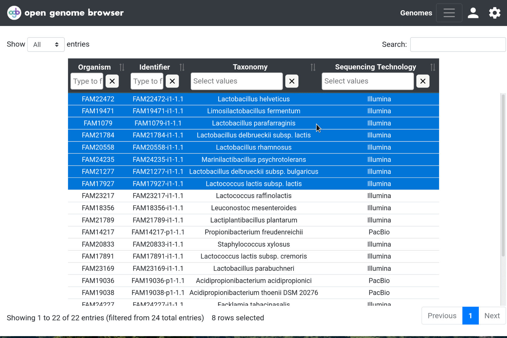

<link rel="shortcut icon" type="image/svg+xml" href="/opengenomebrowser/favicon.svg">

# Phylogenetic Trees

In the [genomes table](https://opengenomebrowser.bioinformatics.unibe.ch/genomes), select multiple genomes (using `Shift` and `Ctrl`) and 
open the context menu using right click. Then, click on "Show phylogenetic trees".

It has the following options:

  - TaxId-based tree: Fastest, based on taxid-annotations only.
  - Genome-similarity-based tree: Still fast, based on pairwise assembly similarity (default: GenDisCal - PaSiT6 ([Goussarov et al., Bioinformatics, 2020](https://pubmed.ncbi.nlm.nih.gov/31899493/))
  - Single-copy-ortholog-based tree: Slow, high quality tree, based on [OrthoFinder](https://github.com/davidemms/OrthoFinder) consensus tree of all single-copy ortholog alignments ([Emms et al., Molecular Biology and Evolution, 2017]())

