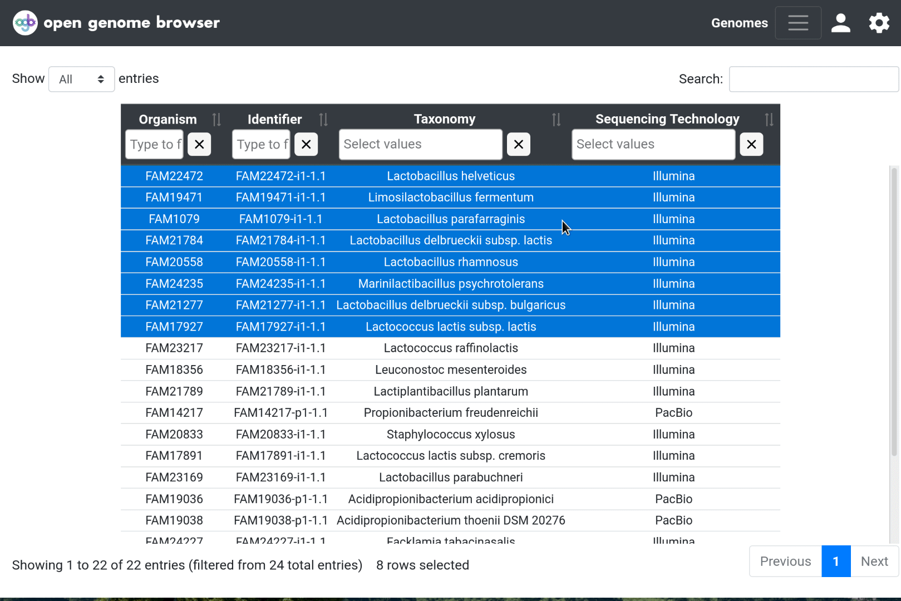

<link rel="shortcut icon" type="image/svg+xml" href="/opengenomebrowser/favicon.svg">

# Phylogenetic Trees

In the [genomes table](https://opengenomebrowser.bioinformatics.unibe.ch/genomes), select multiple genomes (using `Shift` and `Ctrl`) and 
open the context menu using right click. Then, click on "Show phylogenetic trees".

The following analysis options are available:

  - TaxId-based tree: Short calculation time but based on taxid-annotations only (NOT on sequence similarity).
  - Genome-similarity-based tree: Short calculation time, based on pairwise comparisons of assemblies (default: 
    GenDisCal - PaSiT6 ([Goussarov et al., Bioinformatics, 2020](https://pubmed.ncbi.nlm.nih.gov/31899493/))
  - Single-copy-ortholog-based tree (core-genome-based tree): Long calculation time. The methodology is based on 
    [OrthoFinder](https://github.com/davidemms/OrthoFinder) consensus tree of all single-copy ortholog alignments ([Emms et al., Genome Biology, 2019](https://genomebiology.biomedcentral.com/articles/10.1186/s13059-019-1832-y))

